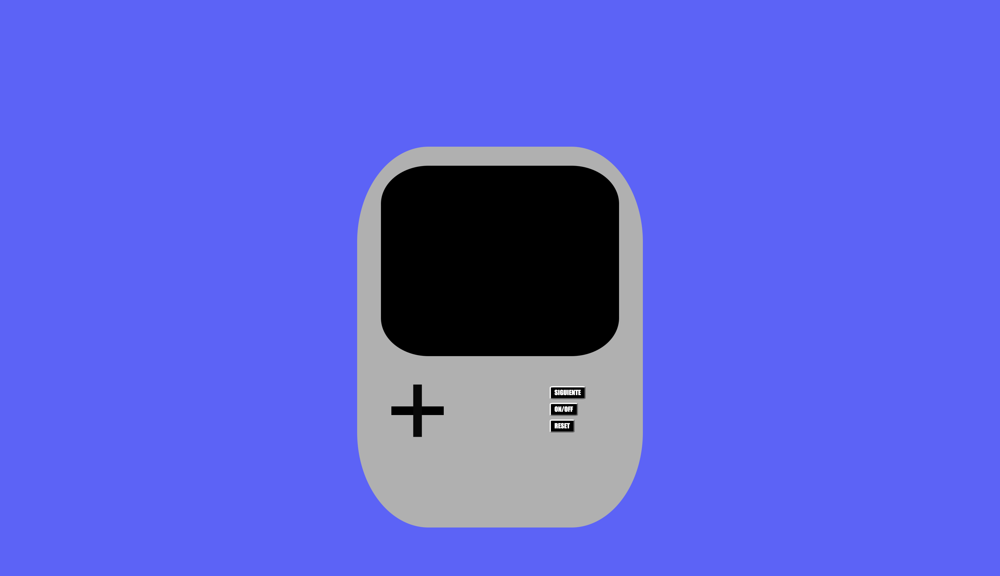
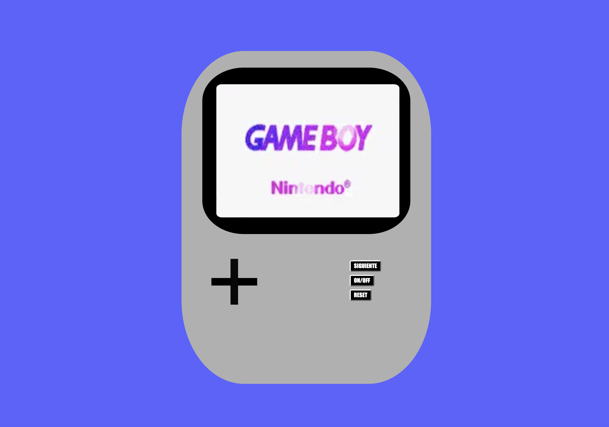
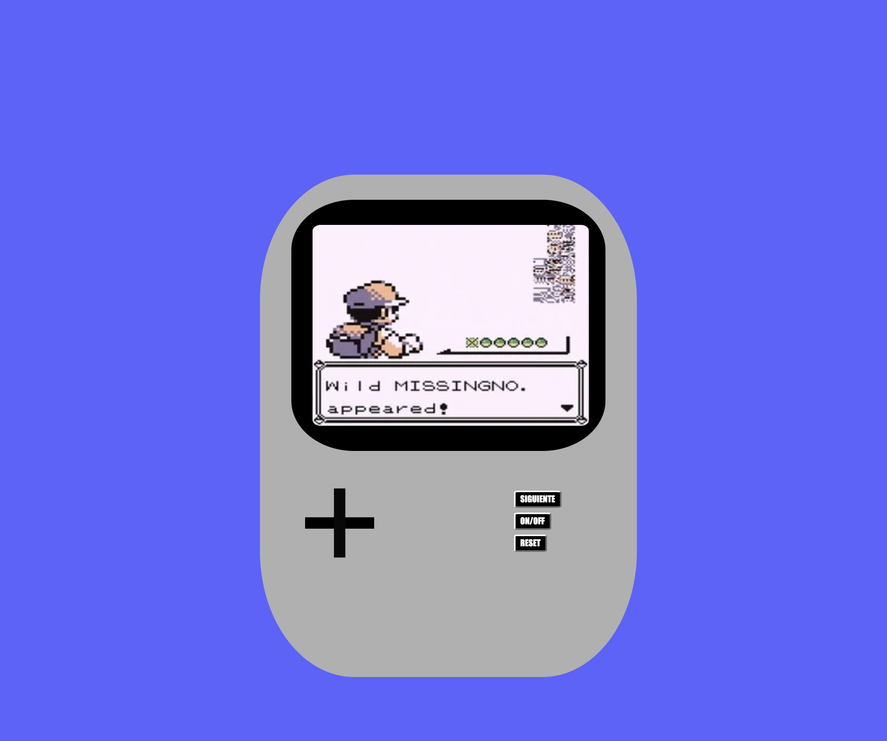
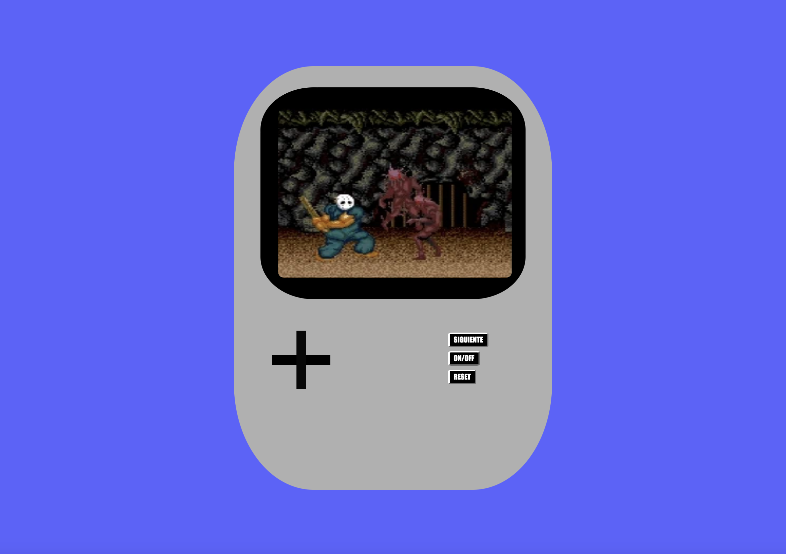
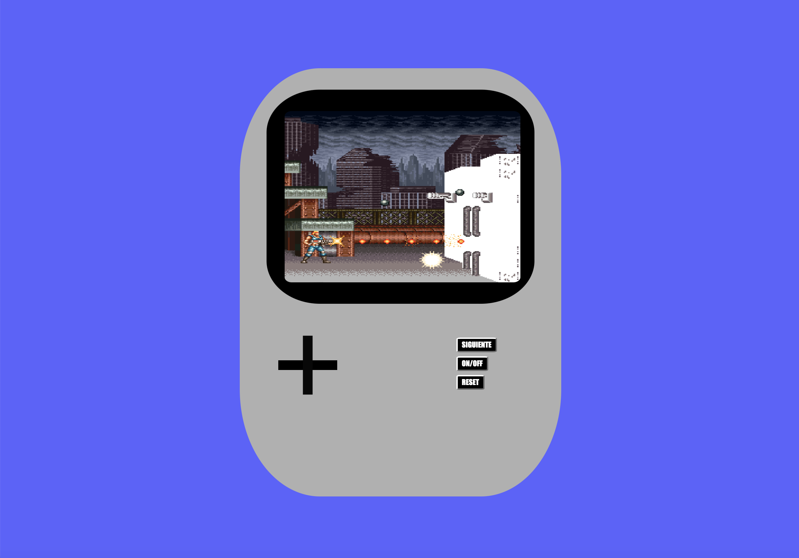
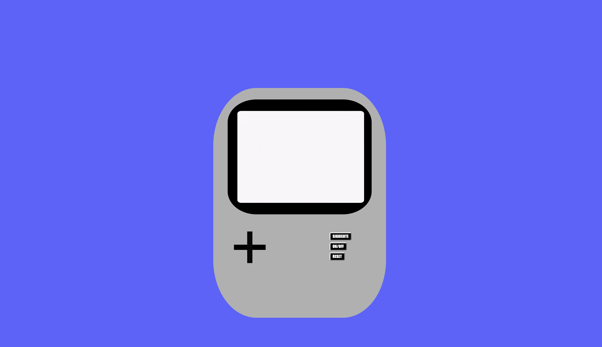

# Welcome to my second frontend app

<details>
  <summary>Videconsola📟</summary>
  <ol>
    <li><a href="#objetivo-🎯">Objetivo</a></li>
    <li><a href="#sobre-el-proyecto-🔎">Sobre el proyecto</a></li>
    <li><a href="#stack">Stack</a></li>
    <li><a href="#instalación-en-local">Instalación</a></li>
    <li><a href="#vistas">Vistas</a></li>
    <li><a href="#contribuciones">Contribuciones</a></li>
    <li><a href="#desarrollo">Desarrollo</a></li>
    <li><a href="#agradecimientos">Agradecimientos</a></li>
    <li><a href="#contacto">Contacto</a></li>
  </ol>
</details>

## Objetivo 🎯
Este  proyecto requería construir una videoconsola usando javascript para una funcionalidad básica.

## Sobre el proyecto 🔎
Decidí crear una pequeña videoconsola mediante HTML5 y CSS para darle un estilo vintage como las consolas de antes.
Mediante Javascript hice funcionar las acciones de encendido y apagado,la visualizacion de los tres diferentes juegos que hay en ella y el botón de reset. 
Si la consola se mantiene apagada ninguno de los demás botones funcionará.
  


## Stack
<div align="center">
<a href="">
    
</a>
<a href="">
    
</a>

 </div>

## Instalación en local
1. Clonar el repositorio
 2. Abrir carpeta en tu ordenador
## Vistas

Apagado
</br> 
  
</br> 
</br> 
Encendido
</br> 

</br> </br>
Pantalla uno
</br> 

</br> </br>
Pantalla dos
</br>

</br> </br>
Pantalla tres
</br>

</br> </br>
Reset
</br>



## Contribuciones
Las sugerencias y aportaciones son siempre bienvenidas.  

Puedes hacerlo de dos maneras:

1. Abriendo una issue
2. Crea un fork del repositorio
    - Crea una nueva rama  
        ```
        $ git checkout -b feature/nombreUsuario-mejora
        ```
    - Haz un commit con tus cambios 
        ```
        $ git commit -m 'feat: mejora X cosa'
        ```
    - Haz push a la rama 
        ```
        $ git push origin feature/nombreUsuario-mejora
        ```
    - Abre una solicitud de Pull Request


## Desarrollo:

``` js
 const developer = "María Lázaro";

 console.log("Desarrollado por: " + developer);
```  

## Agradecimientos:

Agradezco a mis profesores y compañeros de Geekshubs el tiempo dedicado a las dudas que me han ido surgiendo a lo largo de mi segundo proyecto.


## Contacto

<a href = "mailto:marialazaro.code@gmail.com"></a>
<a href="https://www.linkedin.com/in/linkedinUser/" target="_blank"></a> 
</p>
